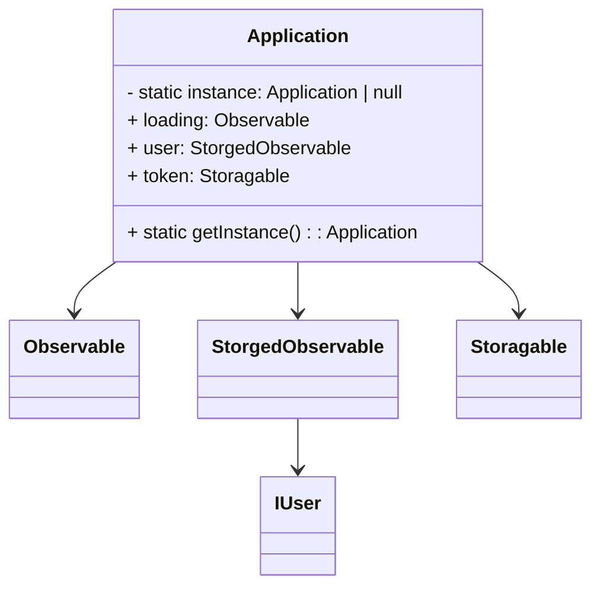

```mermaid
classDiagram
    class Application {
        - static instance: Application | null
        + loading: Observable<boolean>
        + user: StorgedObservable<IUser | null>
        + token: Storagable<string | null>
        + static getInstance(): Application
    }
    class Observable {
    }
    class StorgedObservable {
    }
    class Storagable {
    }
    class IUser {
    }
    Application --> Observable
    Application --> StorgedObservable
    Application --> Storagable
    StorgedObservable --> IUser
```