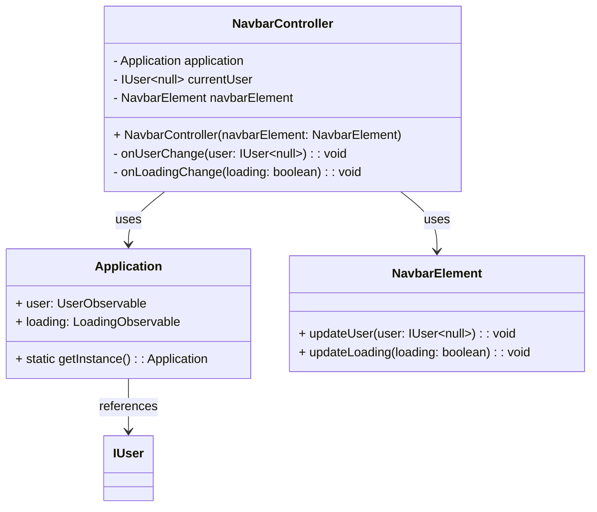

```mermaid
classDiagram
    class NavbarController {
        - Application application
        - IUser~null~ currentUser
        - NavbarElement navbarElement
        + NavbarController(navbarElement: NavbarElement)
        - onUserChange(user: IUser~null~): void
        - onLoadingChange(loading: boolean): void
    }
    class Application {
        + static getInstance(): Application
        + user: UserObservable
        + loading: LoadingObservable
    }
    class NavbarElement {
        + updateUser(user: IUser~null~): void
        + updateLoading(loading: boolean): void
    }
    class IUser

    NavbarController --> Application : uses
    NavbarController --> NavbarElement : uses
    Application --> IUser : references
```