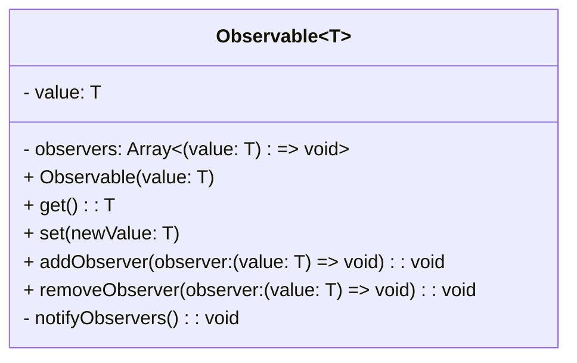

```mermaid
classDiagram
    class Observable~T~ {
        - value: T
        - observers: Array<(value: T) => void>
        + Observable(value: T)
        + get(): T
        + set(newValue: T)
        + addObserver(observer: (value: T) => void): void
        + removeObserver(observer: (value: T) => void): void
        - notifyObservers(): void
    }
```